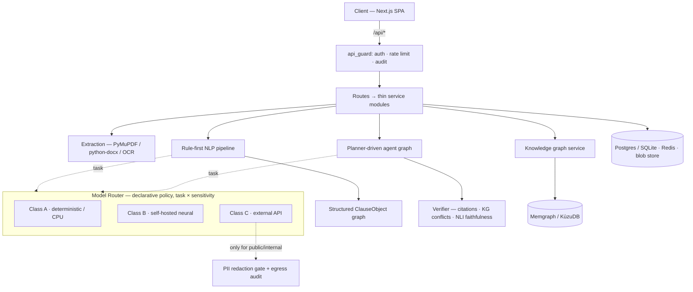

<div align="center">

# LegalAI

### Self-hosted legal contract intelligence

Clause extraction, risk analysis, plain-English rewrites, a planner-driven agent
pipeline with faithfulness verification, a portfolio knowledge graph, and
negotiation drafting — with **every model call routed by sensitivity tier** so
privileged text never leaves your perimeter.

[](.github/workflows/backend-tests.yml)
[](backend/)
[](frontend/)
[](LICENSE)
[](#deployment-profiles)

</div>

---

## Table of contents

- [What it does](#what-it-does)
- [Why it's built this way](#why-its-built-this-way)
- [Architecture](#architecture)
- [Feature tour](#feature-tour)
- [Tech stack](#tech-stack)
- [Quick start](#quick-start)
- [Configuration](#configuration)
- [Using the API](#using-the-api)
- [Project layout](#project-layout)
- [Testing](#testing)
- [Deployment profiles](#deployment-profiles)
- [Research track](#research-track)
- [Documentation](#documentation)
- [Roadmap](#roadmap)
- [Contributing](#contributing)
- [License](#license)

---

## What it does

Upload a contract (PDF, DOCX, TXT, or a scanned image) and LegalAI runs it
through a rule-first pipeline that turns flat text into a **structured clause
graph**, then layers analysis on top:

| Capability | What you get |
| --- | --- |
| **Structured extraction** | Every clause typed and tagged — deontic modality (obligation / permission / prohibition / discretion), defined terms, cross-references, money & jurisdiction entities, temporal expressions, ambiguity flags. Rule-based first, GLiNER NER where enabled. |
| **Plain-English rewrite** | Whole document or a single clause, in "layman" or "advanced" register. |
| **Risk radar** | Keyword sweep across an 8-category taxonomy + a contextual AI pass, aggregated into a spider chart with click-to-drill-down to the exact clauses. |
| **Timeline & simulation** | Structure tree, descriptive timeline, and a discrete-event simulation classifying every resolved date as past / upcoming / future against a configurable window. |
| **Grounded Q&A** | Ask anything about the contract; the answer is entailment-checked against the source text by an NLI head, and unsupported claims are surfaced — not hidden. |
| **Planner-driven agents** | A pipeline that *decides which agents to run* for this document, researches flagged clauses via hybrid RAG, checks the knowledge graph for cross-document conflicts, writes a cited summary, and verifies it before you see it. |
| **Portfolio knowledge graph** | Defined terms linked across documents, candidate cross-document obligation/prohibition conflicts, bitemporal version history — explored as an interactive graph. |
| **Negotiation drafting** | Each clause compared against your organisation's preferred language, with a redline diff and rationale for every deviation. Every suggestion is *pending review* — nothing is auto-applied. |
| **Cross-document consistency** | Embedding-similarity comparison that catches contradictions using different wording and different defined terms, which an exact-term match structurally can't. |

Everything is a **live endpoint** with an honest degradation path: the knowledge
graph no-ops when Memgraph is down, the NLI head falls back to lexical overlap,
and an un-configured generation call raises a clear error instead of guessing.

---

## Why it's built this way

Contract review is high-stakes, repetitive, and full of text a firm or in-house
team **cannot** send to a third-party API. The interesting version of this
product isn't "call a big model" — it's *"get genuinely useful analysis while
the privileged text never leaves the building."* That constraint shaped every
decision:

- **Provider-agnosticism is enforced, not intended.** No module outside the
  Model Router's provider package may import a vendor SDK — a CI-gated
  import-linter contract. Services name a *task*; the router picks the provider.
  This is what keeps the air-gapped build actually air-gapped.
- **Sensitivity is a first-class property.** Every document is classified
  `public` / `internal` / `confidential` / `privileged` on upload. The Model
  Router's Class-C gate keys on it and **fails closed**: confidential and
  privileged documents are structurally unable to reach an external provider. A
  PII redaction gate masks identifiers before any external dispatch, and every
  such dispatch is logged with a SHA-256 of the exact text sent (never the
  payload).
- **The verifier can fail the run.** Every agent summary and grounded answer is
  entailment-checked against its sources. A fabricated citation, a knowledge-graph
  conflict, or an unsupported claim sets `needs_human_review` and drops the run
  into a real queue.
- **Model choices are gated by evaluation.** A task routes to a self-hosted model
  by default *only* when a graded cutover gate shows it meets or beats the
  external baseline. "We chose not to ship this model" is a CI-enforced
  invariant with a model card explaining why.
- **Nothing is auto-applied.** Redlines, sensitivity overrides, and flagged
  analyses all route through a human.

The full story is an eight-phase engineering case study — see
[`docs/v2/ROADMAP.md`](docs/v2/ROADMAP.md) and the append-only engineering
journal.

---

## Architecture



**Request flow.** `app/main.py` wires each router under `/api`, every one behind
`Depends(api_guard)` (auth → rate limit → audit row). Routes are thin: a route
file pairs with one service module. The additive `/api/v2/*` surface is
document-first — it takes a persisted `document_id` instead of raw text and
reuses the same service functions.

**Model Router** (`app/services/model_router/`). Every AI call names a *task*
(`clause_rewrite`, `qa`, `risk_analysis`, `agent_summary`, …), never a model or
vendor. Providers are grouped by **hosting class**: A (deterministic/CPU — a
hashing embedder, a lexical reranker), B (self-hosted neural — an
OpenAI-compatible LLM endpoint, TEI embeddings/rerank, a local NLI head, GLiNER
NER), C (external API — Gemini, an optional plugin). The routing policy
(`app/policies/routing.yaml`) maps each task to an ordered candidate chain;
a Class-C provider is appended *only* when external providers are enabled **and**
the sensitivity tier permits it, and never as an escalation target.

**Agent pipeline** (`app/agents/`, LangGraph). `extraction → planner →
dispatch-by-plan → verifier`. The planner (rule heuristics, or an LLM plan that
falls back to rules) sets which nodes run — a document with no risk signal runs
just `extraction → planner → verifier`. The verifier is the mandatory release
gate. An opt-in DBOS durable-execution engine checkpoints each node so a crashed
process resumes from the last completed step.

Full design: [`docs/v2/ARCHITECTURE.md`](docs/v2/ARCHITECTURE.md).

---

## Feature tour

### The workspace (`/documents/[id]`)

A tabbed analysis surface over one document — **Overview · Clauses · Risk ·
Timeline · Negotiation · Knowledge Graph · Agents · Ask** — with a shared
analysis cache, a persistent sensitivity badge sourced from the real
classification, bitemporal version history, and a scan-quality warning for
low-quality OCR pages.

### The rest of the app

| Route | Purpose |
| --- | --- |
| `/welcome` | Guided onboarding — upload, try a bundled sample NDA (real pipeline, nothing stubbed), or explore. |
| `/dashboard` | Workspace overview; a teaching empty state before your first upload. |
| `/documents` | Client-side library (grid/list, search, filter, tags). |
| `/assistant` | Multi-conversation chat over the single-turn `/ask` endpoint, with per-answer faithfulness badges. |
| `/knowledge-graph` | Portfolio term explorer — usage across ingested documents, candidate conflicts, an as-of time-travel control. |
| `/review` | Human review queue — every analysis the verifier flagged, with a resolve action. |
| `/evaluation` | Most-recent eval run per task/provider, candidate-vs-baseline score bars, cutover pass/fail, admin delta report. |
| `/analytics` | Provider latency, Class-C egress by provider, evaluation pass rate, recent external dispatches. |
| `/models` | Model Router — providers, hosting classes, reachability, routing policy version. |
| `/admin/*` | Health, users (RBAC), per-task Class-C kill switches, the SHA-256 egress audit log, feature flags. |
| `/settings` | Negotiation playbook editor, appearance, keyboard shortcuts, local-data controls. |

The marketing site (`/`, `/features`, `/architecture`, `/research`, `/docs`,
`/about`, `/contact`) and the app are **one product** — you can move between
them from any page.

---

## Tech stack

| Layer | Choice |
| --- | --- |
| **Backend** | FastAPI · Pydantic · SQLAlchemy · Postgres / SQLite · Redis |
| **AI orchestration** | LangGraph · DBOS (durable execution) · a declarative Model Router · `import-linter` provider-isolation contract |
| **Models** | Qwen3-8B/14B (Ollama / vLLM) · `bge-m3` + `bge-reranker-v2-m3` on TEI · DeBERTa/ModernBERT NLI head · GLiNER zero-shot NER |
| **Retrieval & graph** | Hybrid RAG with reciprocal rank fusion · `rank-bm25` · FAISS · Memgraph *or* embedded KùzuDB |
| **NLP / CV** | regex-first pipeline · `dateparser` · PyMuPDF · OpenCV · Tesseract OCR fallback |
| **Frontend** | Next.js 16 (App Router, Turbopack) · React 19 · TypeScript · Tailwind v4 · TanStack Query · Radix primitives · Framer Motion · React Flow · Recharts · Zustand |
| **Eval & training** | Inspect AI · LegalBench · MLflow · DVC · Argilla |
| **Observability & governance** | OpenTelemetry · SHA-256 egress audit trail · per-call routing logs · per-key + per-user RBAC |

Everything is self-hostable. Nothing phones home by default.

---

## Quick start

### Prerequisites

- **Python 3.13** and **Node.js 20+**
- Optional: **Docker** (for Postgres / Redis / Memgraph and the self-hosted
  inference layer)
- Optional: an **NVIDIA GPU** + the NVIDIA Container Toolkit (for self-hosted
  generation)

### 1. Backend — zero-config path

```bash
git clone https://github.com/shourya-tiwari/Legal-AI.git
cd Legal-AI/backend

python -m venv .venv
source .venv/bin/activate            # .venv\Scripts\activate on Windows
pip install -r requirements.txt

uvicorn app.main:app --reload
```

The API is now at **http://127.0.0.1:8000** (docs at `/docs`). With no `.env` at
all it uses a local SQLite file, disables rate limiting, no-ops the knowledge
graph — and embeddings fall back to a local hashing provider. A generation call
(rewrite, Q&A, agent summary) needs at least one provider configured — see
[Configuration](#configuration).

Optional extras (install as needed):

| File | Adds |
| --- | --- |
| `requirements-local.txt` | in-process neural embed/rerank, the NLI faithfulness head, GLiNER NER |
| `requirements-external.txt` | the Gemini Class-C plugin (`google-genai`) |
| `requirements-durable.txt` | DBOS durable agent execution |
| `requirements-collapsed.txt` | embedded KùzuDB (no graph server) |
| `requirements-observability.txt` | OpenTelemetry tracing |
| `requirements-eval.txt` | the graded eval harness (Inspect AI + HF datasets) |
| `requirements-train.txt` | the fine-tuning scaffold (`backend/training/`) |

### 2. Frontend

```bash
cd Legal-AI/frontend
npm install
npm run dev
```

Open **http://localhost:3000**. Point it at a backend with
`NEXT_PUBLIC_API_BASE_URL` (`frontend/.env.local.example`); defaults to
`http://127.0.0.1:8000/api`. When `AUTH_REQUIRED=false` no login is needed.

### 3. Optional — infra services

```bash
docker compose up -d                 # postgres + redis + memgraph
```

Then set `DATABASE_URL`, `REDIS_URL`, `MEMGRAPH_URI` in `backend/.env` (see
`backend/.env.example`).

### 4. Optional — self-hosted inference layer

```bash
./scripts/bootstrap_selfhosted.sh    # docker compose --profile gpu up -d
```

Serves Qwen3-8B on Ollama plus `bge-m3` / `bge-reranker-v2-m3` on TEI, waits for
health, and prints the `.env` lines to paste in.

---

## Configuration

All configuration is read through `app/config.py`'s cached `Settings` object —
the single source of truth. Full annotated reference: `backend/.env.example`.

### Model providers

| Variable | Default | Description |
| --- | --- | --- |
| `LLM_BASE_URL` | — | OpenAI-compatible endpoint for self-hosted generation (Class B). Unset → generation raises `ModelRouterError` unless Gemini is enabled. |
| `LLM_MODEL` | `qwen2.5:3b` | Model name on `LLM_BASE_URL`. |
| `LLM_LARGE_MODEL` | `qwen3:14b` | The `hard=True` escalation target — a bigger *self-hosted* model, never Class C. |
| `EMBEDDING_BASE_URL` / `RERANKER_BASE_URL` | — | TEI (or Infinity) servers for self-hosted embeddings / reranking. Unset → in-process `sentence-transformers` if installed, else the Class-A hashing embedder / lexical reranker. |
| `NLI_MODEL` / `NLI_ENABLED` | DeBERTa-v3-MNLI / off | The verifier's Phase-6 faithfulness head (Class A, in-process transformers). Fails soft to lexical overlap. |
| `NER_MODEL` / `NER_ENABLED` / `NER_LABELS` | GLiNER multi-v2.1 / off | Zero-shot NER (Class B). Fails soft to regex-only. |
| `GOOGLE_API_KEY` | — | Enables the Gemini Class-C plugin (needs `EXTERNAL_PROVIDERS_ENABLED=true` and `requirements-external.txt`). Routed **only** for `public` / `internal` documents. |
| `GENAI_MODEL` | `gemini-flash-latest` | Gemini model name. |
| `EXTERNAL_PROVIDERS_ENABLED` | `false` | Master switch for Class C. `false` (or `STRICT_LOCAL_ONLY=true`, or not installing `requirements-external.txt`) → fully self-hosted / air-gapped. |
| `PII_REDACTION_ENABLED` | `true` | Masks SSN / card / email / phone (regex) + names / addresses (GLiNER) the instant the router resolves a Class-C provider. Never fires for a self-hosted call. |
| `MODEL_CALL_LOGGING` | `true` | Persists one row per routing decision to `model_calls`. |
| `OTEL_ENABLED` / `OTEL_EXPORTER_OTLP_ENDPOINT` | off | OpenTelemetry tracing (needs `requirements-observability.txt`). Fails soft. |

### Infrastructure

| Variable | Default | Description |
| --- | --- | --- |
| `DATABASE_URL` | `sqlite:///./legalai.db` | Point at Postgres with `postgresql+psycopg://…` (psycopg3). |
| `REDIS_URL` | — | Rate-limiting backend. Empty/unset → rate limiting disabled (fails open). |
| `AUTH_REQUIRED` | `false` | `true` → require `Authorization: Bearer <credential>` on every `/api/*` call. |
| `RATE_LIMIT_PER_MINUTE` | `60` | Per org (auth mode) or per client IP (default mode). |
| `MEMGRAPH_URI` | `bolt://127.0.0.1:7687` | KG endpoints no-op if unreachable. An IP literal, not `localhost`, to avoid a slow dual-stack timeout. |
| `KG_BACKEND` | `memgraph` | `kuzu` routes the KG to an embedded, disk-backed graph (`requirements-collapsed.txt`) — no server. |
| `FILE_STORAGE_DIR` | `./file_storage` | Content-addressed store for the original uploaded bytes. No S3/MinIO required. |
| `DURABLE_EXECUTION_ENABLED` | `false` | `true` routes the agent pipeline through the DBOS engine (Postgres-backed). |
| `SENSITIVITY_ENABLED` / `DEFAULT_SENSITIVITY_TIER` | `true` / `internal` | Document sensitivity classification. |

---

## Using the API

Interactive docs (Swagger UI) at **`/docs`**, OpenAPI schema at
**`/openapi.json`**. Regenerate the frontend's typed client with
`cd frontend && npm run codegen`.

### V1 — raw text in, JSON out

```bash
# Upload (also stores the original bytes, content-addressed)
curl -F "file=@contract.pdf" http://127.0.0.1:8000/api/upload

# Plain-English rewrite
curl -X POST http://127.0.0.1:8000/api/rewrite \
  -H 'Content-Type: application/json' \
  -d '{"text": "This Agreement...", "mode": "layman"}'

# Structured clause analysis (fully offline, rule-based)
curl -X POST http://127.0.0.1:8000/api/nlp/analyze \
  -H 'Content-Type: application/json' \
  -d '{"contract_text": "The Tenant shall pay a deposit within 30 days."}'

# Grounded Q&A (answer is entailment-checked)
curl -X POST http://127.0.0.1:8000/api/ask \
  -H 'Content-Type: application/json' \
  -d '{"contract_text": "...", "question": "How can this be terminated?"}'
```

### V2 — document-first (takes a persisted `document_id`)

```bash
# Planner-driven agent analysis (persists a full audit trace + case record)
curl -X POST http://127.0.0.1:8000/api/v2/documents/1/analyze \
  -H 'Content-Type: application/json' \
  -d '{"analysis_mode": "full"}'

# Risk dashboard, timeline simulation, consistency, negotiation, KG…
curl -X POST http://127.0.0.1:8000/api/v2/documents/1/risk-dashboard
curl -X POST http://127.0.0.1:8000/api/v2/documents/1/simulate \
  -d '{"warning_window_days": 30}'
```

### Knowledge graph

```bash
curl -X POST http://127.0.0.1:8000/api/kg/ingest  -d '{"document_id": 1}'
curl -X POST http://127.0.0.1:8000/api/kg/query   -d '{"term": "Confidential Information"}'
curl -X POST http://127.0.0.1:8000/api/kg/conflicts -d '{"term": "Confidential Information"}'
```

### Authentication

When `AUTH_REQUIRED=true`, issue an API key:

```bash
cd backend && python scripts/create_api_key.py "My Org" "ci-key" [role]
```

The raw key (`lai_…`) is printed once — only its SHA-256 hash is stored. Send it
as `Authorization: Bearer lai_…`. Per-user login (`POST /api/auth/login` →
`sess_…` token) and RBAC (`admin` / `editor` / `viewer`) are managed under
`/api/auth/users`.

---

## Project layout

```
Legal-AI/
├── backend/
│   ├── app/
│   │   ├── main.py                 # router wiring + one global exception handler
│   │   ├── config.py               # the cached Settings object (single source of truth)
│   │   ├── guard.py                # api_guard: auth + rate limit + audit, per request
│   │   ├── routes/                 # thin route → service pairs (15 files, 43 endpoints)
│   │   ├── services/
│   │   │   ├── model_router/       # the only place a provider SDK may be imported
│   │   │   ├── nlp/                # rule-first pipeline → ClauseObject graph
│   │   │   ├── cv/                 # blur / skew / redaction triage (CPU, no trained model)
│   │   │   ├── rag/                # hybrid retrieval (dense + sparse + graph, RRF)
│   │   │   ├── kg/                 # Memgraph + KùzuDB clients, bitemporal versioning
│   │   │   ├── risk_radar/         # keyword taxonomy + AI pass
│   │   │   ├── sensitivity/        # the 4-tier classifier
│   │   │   ├── redaction.py        # the PII gate before every Class-C dispatch
│   │   │   └── durable/            # the DBOS engine (opt-in)
│   │   ├── agents/                 # planner-driven LangGraph + typed tool registry
│   │   ├── eval/                   # graded harness + cutover gate
│   │   └── policies/routing.yaml   # task → ordered provider chain
│   ├── training/                   # fine-tuning scaffold + MLflow/DVC (GPU-blocked)
│   ├── tests/                      # 399 passing
│   └── requirements*.txt           # base + 7 optional extras
├── frontend/                       # Next.js 16 SPA — see frontend/README.md
├── docs/v2/                        # architecture, roadmap, AI stack, NLP, KG, agents, novelty
├── docker-compose.yml              # postgres · redis · memgraph (+ gpu profile: ollama · tei)
├── scripts/                        # setup_venv.sh · bootstrap_selfhosted.sh
└── LEARNING_LOG.md                 # append-only engineering journal
```

---

## Testing

```bash
cd backend
pytest                              # 399 passing, 2 skipped
```

Tests mock `generate_content` at each consumer module and run in the
**self-hosted-first posture** (`EXTERNAL_PROVIDERS_ENABLED=false`) — no
`GOOGLE_API_KEY` or network needed. CI (`.github/workflows/backend-tests.yml`)
runs the full suite with `requirements-external.txt` **plus** a
`core-only-smoke` job that installs `requirements.txt` alone and proves the
product still works with no `google-genai` present. A `test_provider_isolation`
test (and `.importlinter`) enforce that no module outside
`model_router/providers/` imports a provider SDK.

Frontend:

```bash
cd frontend
npm run lint
npm run build
```

---

## Deployment profiles

The same codebase serves four postures — each changes only configuration and
which optional requirements are installed:

| Profile | How | Notes |
| --- | --- | --- |
| **Cloud / hosted** | Postgres + Redis + Memgraph, `EXTERNAL_PROVIDERS_ENABLED=true` | Gemini available for `public` / `internal` documents where a cutover gate shows it wins. |
| **On-prem** | Postgres + Memgraph + the `gpu` compose profile (Qwen3 + TEI) | No external calls; a 16 GB GPU is the generation ceiling. |
| **Air-gapped** | Don't install `requirements-external.txt`; `STRICT_LOCAL_ONLY=true` | The commercial-provider package is physically absent. A strict CSP, self-hosted fonts, zero runtime CDN. |
| **Collapsed / single-binary** | SQLite + `KG_BACKEND=kuzu` + in-process neural | No separate database or graph server — the laptop profile. |

---

## Research track

Five directions with potential patent value, each independently gated. CPU-only
prototypes are validated; GPU training and formal prior-art searches are the
honest blockers. Full notes: [`docs/v2/NOVELTY.md`](docs/v2/NOVELTY.md).

1. **Deontic Graph Attention Network** for cross-document obligation conflict detection — architecture designed ([`docs/v2/DEONTIC_GAT_DESIGN.md`](docs/v2/DEONTIC_GAT_DESIGN.md)).
2. **Temporal obligation decay simulation** — auto-derives downstream dates from "N days after `<trigger>`" patterns. CPU prototype validated.
3. **Legal-semantic fingerprinting** — contrastive clause embeddings with 122 verified hard-negative triplets. Fine-tune GPU-blocked.
4. **Adaptive negotiation playbook** learning from redline history — prototype produced a precise negative result.
5. **Deontic-structure-aware counterfactual ablation** — corroborated (by a second method) that the trained risk model learned superficial n-grams, not legal structure.

---

## Documentation

| Doc | Contents |
| --- | --- |
| [`docs/v2/OVERVIEW.md`](docs/v2/OVERVIEW.md) | The one-page map |
| [`docs/v2/ARCHITECTURE.md`](docs/v2/ARCHITECTURE.md) | The full target architecture |
| [`docs/v2/ROADMAP.md`](docs/v2/ROADMAP.md) | Phase-by-phase delivery plan and status |
| [`docs/v2/AI_STACK.md`](docs/v2/AI_STACK.md) | The provider-agnostic model stack |
| [`docs/v2/NLP.md`](docs/v2/NLP.md) | The rule-first NLP pipeline |
| [`docs/v2/KNOWLEDGE_GRAPH.md`](docs/v2/KNOWLEDGE_GRAPH.md) | Graph schema and queries |
| [`docs/v2/AGENTS.md`](docs/v2/AGENTS.md) | Agent responsibilities and the memory service |
| [`docs/v2/FRONTEND_PLAN.md`](docs/v2/FRONTEND_PLAN.md) | The frontend implementation plan & IA |
| [`CHANGELOG.md`](CHANGELOG.md) | Release notes |
| `LEARNING_LOG.md` | Append-only engineering journal (every decision, every dead end) |

---

## Roadmap

Eight phases shipped, each one deployable:

- **Phases 0–4** — V1 hardening; FastAPI re-platform (Postgres/Redis, org auth); CPU NLP/CV pipelines; knowledge graph + hybrid RAG; a planner-driven agent pipeline with the NLI verifier.
- **Phase 5** — provider-agnostic Model Router; embeddings/rerank self-hosted; Gemini demoted to an optional Class-C plugin; the import-linter contract.
- **Phase 6** — self-hosted generation target (Qwen3-8B/14B); graded eval harness + cutover gate; GLiNER NER; the NLI head.
- **Phase 7** — sensitivity tiering enforced end-to-end; PII redaction gate + egress audit; RBAC + per-user identity; on-prem / air-gapped packaging; KùzuDB collapsed data layer; DBOS durable execution; three-tier memory service; the first Next.js SPA.
- **Phase 8** — bitemporal graph versioning; cross-document consistency + simulation baselines; the negotiation drafting agent; the risk dashboard + KG explorer; classical training runs (eval-gated, not promoted); MLflow + DVC; five `NOVELTY.md` CPU prototypes.
- **Post-Phase-8** — the production-grade SaaS frontend rebuild (see `CHANGELOG.md`).

**Next:** multi-tenant scale, SOC 2 / GDPR workflows, a streaming agent trace over
a session WebSocket, and a Negotiation Studio. GPU-dependent work (the fine-tuned
clause/deontic heads, the contrastive embedding model, the Deontic-GAT training)
and infrastructure/human-dependent work (legal-expert weak-label review, formal
patent-counsel prior-art searches) are tracked explicitly, not hidden.

---

## Contributing

This is a solo portfolio / final-year engineering project, but issues and
discussion are welcome. If you open a PR:

- Backend: `pytest` must stay green, and `test_provider_isolation` must pass —
  never import a provider SDK outside `model_router/providers/`.
- Frontend: `npm run lint` and `npm run build` must both pass. Read
  `node_modules/next/dist/docs/` before writing Next.js 16 code.
- Use Conventional Commit prefixes.

---

## License

[MIT](LICENSE) © 2025–2026 Shourya Tiwari

Built with Next.js · FastAPI · self-hosted models.
