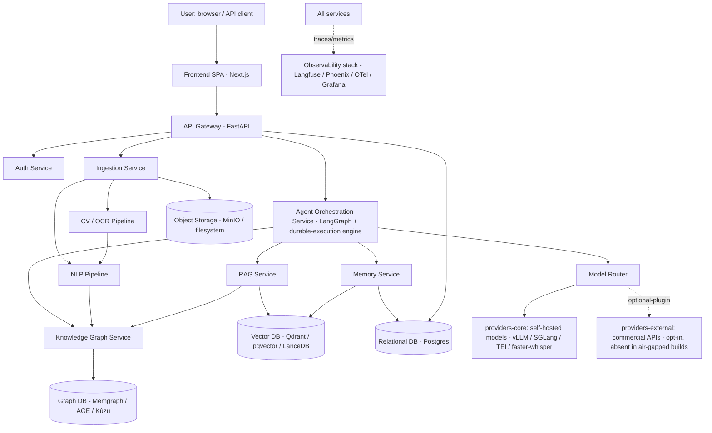

# Architecture

Cross-cutting system design: services, data layer, deployment profiles, security, scalability, developer workflow, and evaluation/observability. Component detail lives in `FRONTEND.md`, `BACKEND.md`, `AI_STACK.md`, `MODEL_STACK.md`, `AGENTS.md`, `NLP.md`, `DEEP_LEARNING.md`, `COMPUTER_VISION.md`, and `KNOWLEDGE_GRAPH.md`.

## System context



The dashed edge to `providers-external` is the only place a commercial API can appear, it is an optional package, and it is physically absent from on-prem/air-gapped builds.

## Logical layers

1. **Client layer** — Next.js SPA, plus a documented public REST API (`BACKEND.md`).
2. **Gateway layer** — FastAPI gateway: auth, request validation, routing to internal services, WebSocket/SSE for streaming agent traces.
3. **Orchestration layer** — LangGraph multi-agent graphs, **planner-driven** (`app/agents/planner.py` chooses which agents run per document), later executed by a durable-execution engine (`MODEL_STACK.md`: DBOS/Hatchet default, Temporal at large SaaS scale). The successor to V1's "route → one service function → one Gemini call".
4. **AI service layer** — RAG Service, Knowledge Graph Service, Memory Service, Model Router, NLP pipeline, CV pipeline.
5. **Data layer** — polyglot persistence, with an embedded/collapsed variant for small and air-gapped deployments (below).
6. **Cross-cutting** — security, observability, developer workflow.

## Service inventory

| Service | Responsibility | Kept from V1 / New |
|---|---|---|
| API Gateway | AuthN/Z, request validation, routing, rate limiting | Evolves V1's `main.py` |
| Auth Service | Users, orgs, roles, API keys, session tokens | New |
| Ingestion Service | File intake, sensitivity classification, dispatch to CV/NLP | Evolves `routes/upload.py` + `extractor.py` |
| CV Pipeline | Layout/OCR/table/signature detection (`COMPUTER_VISION.md`) | New |
| NLP Pipeline | Segmentation, NER, coref, deontic tagging, classification (`NLP.md`) | New |
| Agent Orchestration Service | Multi-agent planning/execution (`AGENTS.md`) | Replaces per-endpoint service functions |
| RAG Service | Hybrid retrieval + reranking (`AI_STACK.md`) | Evolves `contextualizer/rag.py` |
| Knowledge Graph Service | Graph construction/query (`KNOWLEDGE_GRAPH.md`) | New |
| Memory Service | Session/episodic/semantic/procedural memory (`AGENTS.md`) | New |
| **Model Router** | **Provider-agnostic capability routing** (`AI_STACK.md`): resolves `generate/embed/rerank/transcribe/synthesize` to a `(provider, model)` from a declarative policy; owns *all* provider adapters; the only component that imports a model SDK | **Generalizes V1's `genai_client.py`; no longer Gemini-specific** |
| Notification/Webhook Service | Async job-completion callbacks, org notifications | New |
| Eval & Observability | Trace ingestion, eval-harness runs, dashboards | New |
| **Model Serving** (infra, not a request-path service) | vLLM/SGLang for LLM/VLM, TEI/Infinity for embed/rerank, faster-whisper, Kokoro — on the GPU/CPU model node pool | New — this is the inference layer the Router's Class B talks to |

## Database architecture (polyglot persistence)

No single database is right for a document graph + vectors + relational metadata + hot session state. The **standard profile** uses purpose-built stores; the **collapsed profile** (small on-prem, air-gapped) folds several into Postgres to minimize the number of services an operator runs.

| Store | Standard profile | Collapsed profile | Holds |
|---|---|---|---|
| Relational | **PostgreSQL** | PostgreSQL | Users, orgs, roles, document metadata, sessions, audit log, billing/usage, job status |
| Vector | **Qdrant** | **pgvector + pgvectorscale**, or **LanceDB** (embedded) | Clause/document/memory/corpus embeddings |
| Graph | **Memgraph** / Neo4j CE | **Apache AGE** (Postgres extension) or **KùzuDB** (embedded) | Entities, obligations, cross-references, portfolio relationships (`KNOWLEDGE_GRAPH.md`) |
| Cache / short-term memory | **Redis** (or Dragonfly / Valkey) | Redis / Valkey | Session state, rate-limit counters, hot KG/RAG query cache |
| Object storage | **MinIO** (S3-compatible) | Local filesystem volume | Raw uploads, rendered page images, generated exports |
| Event log | **Redpanda** (Kafka-API) | In-process queue / Postgres-backed queue | Inter-service events (`document.ingested`, `extraction.completed`, `agent.step.completed`) |
| Time-series / metrics | **Prometheus / Mimir** | Prometheus (single binary) or SigNoz | Latency, throughput, model cost, queue depth |
| Durable-workflow store | Temporal's datastore, **or** Postgres (Hatchet/DBOS) | Postgres (DBOS) | Workflow execution state |

Every store here has a mature, self-hostable, permissively-or-copyleft-licensed implementation. **No store requires a commercial licence to run**, and the collapsed profile can bring the whole data layer down to *Postgres + Redis + a filesystem volume*.

### Core relational schema (sketch)

```
organizations(id, name, sensitivity_policy, model_tier_default, allowed_providers[], created_at)
users(id, org_id, email, role, created_at)
documents(id, org_id, uploaded_by, filename, sensitivity_tier, status, storage_uri, created_at)
document_versions(id, document_id, version_no, extracted_text_uri, created_at)
clauses(id, document_version_id, ordinal, text, deontic_tags[], clause_type, kg_node_id)
sessions(id, org_id, user_id, document_id, created_at, last_active_at)
agent_traces(id, session_id, agent_name, step_no, input, output, tool_calls[],
             provider, model, policy_version, verified, created_at)
audit_log(id, org_id, actor_id, action, resource, metadata, egress_target, created_at)
eval_runs(id, suite_name, git_sha, routing_policy_version, provider, model, score, passed, created_at)
model_registry(id, name, version, base_model, train_dataset_snapshot, eval_score, promoted_at)
```

**Shipped so far** (SQLite/Postgres via SQLAlchemy, `create_all` — no migration tool yet): `organizations`, `api_keys`, `documents`, `audit_log`, `agent_traces`, and (Phase 5/6) **`model_calls`** (one row per routing decision — task, provider, hosting_class, latency, ok; fail-soft via `model_router/telemetry.py`) and **`eval_runs`** (task, dataset, provider, metric, score, baseline_score, passed; written by `app/eval/eval_store.py` from the cutover gate). **(Phase 7)** **`case_analyses`** — the run-level counterpart to `agent_traces`' per-step rows: one row per `analyze()` call, carrying `summary`/`faithfulness_ok`/`unsupported_claims`/`invalid_citation_numbers`/`needs_human_review` plus `reviewed`/`reviewed_at`/`reviewer_note`, so the human-in-the-loop review queue (`GET/POST /api/review-queue`) has something to list and resolve — this data used to be computed and returned once in the HTTP response, then discarded. `users`/`sessions`/`document_versions`/`clauses`/`model_registry` are not yet tables — clauses live in the `documents.blocks` JSON and agent state is in-request.

`clauses.kg_node_id` is the join key into the graph store — Postgres is the system of record for text/metadata, the graph store owns relationships and traversal. `agent_traces.provider/model/policy_version` and `audit_log.egress_target` are what make every AI decision — and every byte that left the perimeter — reconstructable after the fact.

## Deployment profiles

Four profiles, one codebase, selected per organization by data-sensitivity policy:

| Profile | Where it runs | Providers available | `providers-external` present? | Use case |
|---|---|---|---|---|
| **Cloud (multi-tenant)** | Platform-managed Kubernetes | Class A + B; Class C opt-in per org | Yes (opt-in per org, default off) | Default SaaS |
| **Hybrid (single-tenant VPC)** | Customer's cloud VPC, platform-managed control plane | Class A + B; Class C opt-in per document for `Public`/`Internal` only | Optional (customer decides at install) | Regulated customers (finance, healthcare-adjacent legal) |
| **On-prem** | Customer's own datacenter (Kubernetes or k3s) | Class A + B only | **No** — excluded at build time | High sensitivity, data-residency requirements |
| **Air-gapped** | Customer infrastructure, no outbound network at all | Class A + B only | **No** — excluded at build time and verified by SBOM allowlist | Government, litigation-hold, defense |

Every feature is available in every profile. The only thing that changes across profiles is the model-quality ceiling on the handful of tasks where the eval harness shows Class C would add measurable value — and even there, the self-hosted default produces a real answer, not an error.

### Deployment mechanics

- **Containerization**: every service ships as a signed container image (cosign); Kubernetes with per-service Helm charts; Kustomize overlays per profile.
- **Infrastructure as Code**: **OpenTofu** (not Terraform — licensing) for cloud resources; Helm + Kustomize for manifests; all environment-parameterized (dev/staging/prod/on-prem/air-gap templates).
- **Air-gapped delivery**: the entire application — images, charts, manifests, model weights, and the seed legal corpus — is packaged with **Zarf** into a single declarative artifact that installs into a disconnected cluster from removable media. Model weights ship as signed **KitOps ModelKit** OCI artifacts through the customer's **Harbor** registry. There is no `pip install` or `huggingface-cli download` on the target.
- **Model serving**: open-weight LLMs/VLMs via **vLLM** / **SGLang**; embeddings/rerankers via **TEI** / **Infinity**; ASR via **faster-whisper**; on the constrained profile, **Ollama** / **llama.cpp**.
- **GPU pools**: a dedicated GPU node pool (NVIDIA GPU Operator) autoscaled by durable-workflow queue depth, separate from the CPU-only API/orchestration pool. The constrained profile runs LLM inference on CPU (llama.cpp) and accepts the latency.
- **CI/CD**: build → test → import-linter contract check → eval-gate → deploy to staging → manual promotion to prod, per service, via GitOps (Argo CD / Flux).

## Security architecture

Legal documents are among the most sensitive data an org holds (privileged communications, PII, deal terms). Security is foundational.

1. **Data sensitivity classification at ingestion.** — **shipped (Phase 7).** `app/services/sensitivity/` classifies every document into `public` / `internal` / `confidential` / `privileged` at upload (rule-based Tier-0; `internal` is the conservative default). The tier persists on `documents.sensitivity_tier`, is threaded into every model call, and determines which hosting class may process the document (`AI_STACK.md`). `GET`/`PUT /api/v2/documents/{id}/sensitivity` is the org-admin override (audit-logged, and — per item 5 below — now gated to `role="admin"`). A classical / transformer classifier is the `DEEP_LEARNING.md` upgrade once labelled data exists.
2. **Egress control is a hard, mechanical boundary.**
   - `providers-external` is a *separate package*. On-prem/air-gapped builds are produced with an **SBOM allowlist** that fails the build if a commercial-provider SDK (or any transitive dependency that makes outbound calls on its own) is present. The absence is verified, not trusted.
   - In profiles where `providers-external` *is* installed, an egress proxy/network policy denies all outbound traffic except to the explicitly configured provider endpoints, and every byte sent is logged (`audit_log.egress_target`, payload hash, task, policy version, org opt-in reference). **The logging half is shipped (Phase 7):** `model_router/telemetry.py::record_egress` writes an `audit_log` row (`action="model_egress"`) for every successful Class C dispatch — task, provider, model, policy version, a SHA-256 of the exact text sent (never the text itself), and the redaction gate's (item 3) category counts — read back via `GET /api/audit/egress`. The network-level proxy/policy half is not: it needs a real egress boundary (a proxy, network policy enforcement point) this environment has no target to build or validate against, unlike the logging, which needed nothing but the application code.
   - The Router refuses to route a `confidential`/`privileged` document to Class C — **shipped**: `policy.candidates()` drops the Class C candidate for a disallowed tier, and `router._pick_and_call` fails closed (raises, logs ERROR) as a last line if one is ever chained. There is no "override token to allow it anyway" — those tiers are hard-blocked; the override only *lowers* a tier.
3. **PII/PHI-aware redaction gate.** Before any text is sent to a Class C provider, a local NER-based redaction pass (`NLP.md`) flags/masks personal identifiers not required for the task; orgs configure "never send to third party" categories. **Shipped (Phase 7):** `app/services/redaction.py` — a regex floor (SSN, credit card, email, phone; Class A, always on, the same "security property holds even air-gapped" pattern as the sensitivity classifier) merged with optional GLiNER zero-shot spans (person names, physical addresses; Class B, via the Model Router's `ner_extract` task, fail-soft to regex-only). `Router.generate()` calls it the instant a Class C provider is about to be dispatched, replacing the prompt with the redacted version before that provider ever sees it; a self-hosted (Class B) call is never touched, so this has zero effect in an on-prem/air-gapped deployment. Per-org configurable "never send" categories are not yet built — this ships one fixed, global category set.
4. **Encryption.** TLS in transit everywhere (inter-service included); AES-256 at rest for object storage and DB volumes; per-org envelope-encryption keys (KMS / Vault Transit) for `Confidential`/`Privileged`.
5. **Access control.** Org/role RBAC (Admin, Editor, Viewer) plus resource-level ABAC (a user reaches only their org's documents/sessions), enforced at the Gateway and re-checked at each internal service. **Shipped (Phase 7) at both levels, `LEARNING_LOG.md` #36/#37**: `app/guard.py::require_role` gates `PUT /api/v2/documents/{id}/sensitivity` (admin-only) and `POST /api/review-queue/{id}/resolve` (admin/editor) on a caller's role — sourced either from `ApiKey.role` (a machine credential, default `admin` so every pre-existing key keeps full access) or from `User.role` via a login session (`app/routes/auth.py`: `POST /api/auth/login`/`logout`, admin-only user management). Resource-level ABAC (org-scoped document access) has been true since Phase 1 (`_load_doc` filters by `org_id`). `AuditLog.actor_id` + `actor_type` (`"api_key"`|`"user"`) attribute every audited action to the specific credential that made it, disambiguated since both id spaces are plain ints from different tables. Password hashing is PBKDF2-HMAC-SHA256 (stdlib `hashlib`, OWASP's current minimum iteration count) — no new dependency. Still open: self-serve signup and password reset (an org's first user is created by an existing admin or a bootstrap step).
6. **Prompt-injection defense.** Contracts are untrusted text fed into prompts: all agent tool-calling is constrained to an allowlisted JSON schema (no arbitrary code / unbounded network); retrieved/ingested text is wrapped in delimited context blocks, never concatenated into system instructions; the Verifier agent treats document content as data by construction.
7. **Secrets management.** No secrets in `.env` in production (fine for local dev) — Vault or a KMS-backed secret store injects at runtime.
8. **Supply chain.** Every image and model artifact is cosign-signed with a Syft SBOM; Grype/Trivy scan on push to Harbor; deploys are GitOps commits.
9. **Audit trail.** Every agent decision, tool call, routing decision, egress event, and human override is append-only in `agent_traces`/`audit_log` — a security control and the backbone of `AGENTS.md`'s explainability requirement. Egress events specifically: **shipped (Phase 7)**, `GET /api/audit/egress` (item 2).
10. **Compliance posture.** Architected to support SOC 2 Type II and GDPR data-subject-rights workflows (export/delete per org) from day one; the air-gapped profile additionally supports customers with data-residency or classified-handling mandates that a cloud vendor cannot meet at all.

## Scalability

- **Stateless API/gateway tier** scales horizontally; session state lives in Redis/Postgres, not in-process (directly fixing V1's in-memory `document_storage`).
- **Durable, queued agent execution.** Multi-agent workflows run on the durable-execution engine, not blocking HTTP threads — the single biggest scalability change from V1. A crashed worker resumes from the last completed step.
- **Model-serving autoscale.** The GPU node pool scales on workflow-queue depth, not HTTP RPS, since inference is the bottleneck resource. vLLM continuous batching + SGLang prefix caching absorb bursty agent traffic.
- **Vector DB sharding.** Qdrant shards by collection; corpora partitioned per-org for tenant isolation and independent scaling.
- **Graph DB.** Per-org partitioning; periodic snapshot to object storage for durability/DR (Memgraph is in-memory-primary).
- **Caching.** Redis caches hot KG traversals, frequent RAG queries, rendered previews; invalidation keyed to document version.
- **Read replicas.** Postgres read replicas for reporting/dashboards.

## Evaluation & observability

- **Tracing.** OpenTelemetry (GenAI semantic conventions) across all services; agent traces additionally in **Langfuse**, RAG/eval debugging in **Arize Phoenix** — every agent step, tool call, prompt version, routing decision, and token cost inspectable per session.
- **Eval harness.** Continuous, CI-gated evaluation with **Inspect AI** (the suite backbone), **Ragas** (RAG faithfulness/relevance/precision/recall), **promptfoo** (fast pre-merge prompt regression), and a legal-accuracy benchmark from **LegalBench / CUAD / ContractNLI** plus an internal expert-reviewed gold set. **No prompt, model, provider, routing-policy, or fine-tune change merges without passing at or above the current baseline.** The eval judge model is itself self-hosted, so eval has no external dependency.
- **Self-hosted-vs-external delta report.** For each task, the harness runs the current default (Class B) and, where `providers-external` is available, the Class C option, and reports the quality gap. This is the *only* input allowed to justify enabling Class C for a task — never a vendor claim. **Shipped (Phase 6):** `app/eval/delta_report.py` (agreement view) + `app/eval/cutover_gate.py` (the PASS/FAIL gate on a task's graded eval, writes `eval_runs`).
- **Hallucination/faithfulness checks.** A local NLI head (DeBERTa/ModernBERT, Class A) validates that generated claims are entailed by retrieved source text before the Verifier releases an answer (`AGENTS.md`). **Shipped (Phase 6):** `app/services/model_router/providers/nli_local.py` (`verify_nli` task), wired into `app/agents/verifier.py`.
- **Human-in-the-loop review queue.** Low-confidence or high-stakes outputs (below a calibrated threshold, or `Privileged`-tier) route to a reviewer queue before finalization.
- **Drift monitoring.** Scheduled re-evaluation of production-traffic samples against the gold benchmark, to catch quality regression from a model or policy change — the same risk V1's Gemini-migration history already demonstrated, now under our control because the model is ours.
- **Metrics dashboards.** Grafana (LGTM) / SigNoz: latency, cost-per-request by hosting class, queue depth, eval scores over time, per-org usage, egress volume.

## Developer workflow

- **Monorepo** with clear boundaries: `apps/frontend`, `services/*`, `packages/schemas` (shared Pydantic/OpenAPI contracts), `packages/prompts` (versioned templates), `packages/policies` (routing policy), `infra/` (OpenTofu/Helm/Zarf).
- **Import-linter contract**: a CI check that fails if any module outside `services/model_router/providers/` imports a model-provider SDK. This is the enforced mechanism behind "no vendor in the business logic".
- **Environments**: local (docker-compose profile mirroring the full stack at small scale, including a small model via Ollama), dev, staging, prod, and on-prem/air-gap templates.
- **CI/CD gates per service**: lint → type-check → import-linter → unit tests → integration tests (Router pointed at a tiny local model or a deterministic mock) → eval suite (AI-touching changes) → build → deploy-to-staging → manual prod promotion.
- **Prompt/model/policy versioning.** Prompts, model configs, and routing policy are semver'd artifacts; the Router logs which versions produced every output, tying back to `eval_runs`.
- **Feature flags** for staged rollout of new agents/models/providers per org.
- **Local dev parity.** `docker-compose` brings up Postgres/Qdrant/Memgraph/Redis/MinIO + a small Ollama-served model so contributors run the full agent graph with **zero cloud credentials and zero external API keys** — the local experience *is* the air-gapped experience at small scale.

## Relationship to V1

V2 is additive, not a rewrite-from-scratch:

- **Kept**: FastAPI as the gateway framework; the "centralized client, never call a model provider directly from a route" discipline — V1's `genai_client.py` pattern generalizes into the provider-agnostic Model Router; local-first document extraction (CV pipeline extends PyMuPDF/python-docx, doesn't replace them); grounding answers in supplied text over free generation.
- **Replaced**: in-memory `document_storage` → polyglot persistence; one Gemini call per feature → multi-agent orchestration with verification; hardcoded 28-string knowledge base → hybrid RAG over a versioned corpus; **one hardcoded Gemini model → a provider-agnostic Router whose default path is self-hosted open weights**; stateless client-holds-everything → session/episodic/semantic memory; no tests/observability → eval-gated CI and full tracing.
- **Reversed decision**: earlier `docs/v2` drafts modelled Gemini as a permanent "Tier 2". That is retired — commercial APIs are now optional plugins, absent from on-prem/air-gapped builds, never required by any feature. See `ROADMAP.md` for the migration that removes the last hard dependency on a hosted model.
- **Migration path**: V1's endpoints remain served (unversioned `/api/*`) during the transition (`ROADMAP.md`), backed increasingly by V2 services, until the frontend cuts over to the document-first `/api/v2/*`. **Started (Phase 7):** `/api/v2/documents/{id}/{analyze,rewrite,map,ask,risk-scan,contextualize}` reuse the V1 services with a `document_id` instead of a re-sent text blob.
