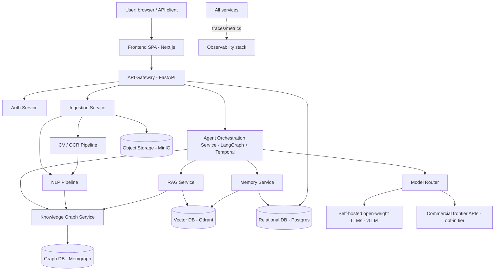

# Architecture

Cross-cutting system design: services, data layer, deployment, security, scalability, developer workflow, and evaluation/observability. Component-level detail lives in `FRONTEND.md`, `BACKEND.md`, `AI_STACK.md`, `AGENTS.md`, `NLP.md`, `DEEP_LEARNING.md`, `COMPUTER_VISION.md`, and `KNOWLEDGE_GRAPH.md`.

## System context



## Logical layers

1. **Client layer** — Next.js SPA, plus a documented public REST API for programmatic access (see `BACKEND.md`).
2. **Gateway layer** — FastAPI gateway: auth, request validation, routing to internal services, WebSocket/SSE endpoints for streaming agent traces.
3. **Orchestration layer** — LangGraph-based multi-agent graphs executed as Temporal workflows (durable, resumable, retryable). This is the direct successor to V1's "route → one service function → one Gemini call."
4. **AI service layer** — RAG Service, Knowledge Graph Service, Memory Service, Model Router, NLP pipeline, CV pipeline (detailed in their own docs).
5. **Data layer** — polyglot persistence (below).
6. **Cross-cutting** — security, observability, and the developer workflow described in this file.

## Service inventory

| Service | Responsibility | Kept from V1 / New |
|---|---|---|
| API Gateway | AuthN/Z, request validation, routing, rate limiting | Evolves V1's `main.py` |
| Auth Service | Users, orgs, roles, API keys, session tokens | New |
| Ingestion Service | File intake, sensitivity classification, dispatch to CV/NLP | Evolves V1's `routes/upload.py` + `extractor.py` |
| CV Pipeline | Layout/OCR/table/signature detection (`COMPUTER_VISION.md`) | New (V1 had text-only extraction) |
| NLP Pipeline | Segmentation, NER, coref, deontic tagging, classification (`NLP.md`) | New (V1 had none — only keyword regex) |
| Agent Orchestration Service | Multi-agent planning/execution (`AGENTS.md`) | Replaces V1's per-endpoint service functions |
| RAG Service | Hybrid retrieval + reranking (`AI_STACK.md`) | Evolves V1's `contextualizer/rag.py` |
| Knowledge Graph Service | Graph construction/query (`KNOWLEDGE_GRAPH.md`) | New |
| Memory Service | Session/episodic/semantic/procedural memory (`AGENTS.md`) | New |
| Model Router | Tiered model selection by sensitivity/task (`AI_STACK.md`) | Generalizes V1's `genai_client.py` |
| Notification/Webhook Service | Async job completion callbacks, org notifications | New |
| Eval & Observability | Trace ingestion, eval harness runs, dashboards | New |

## Database architecture (polyglot persistence)

No single database is right for a document graph + vectors + relational metadata + hot session state. V2 uses:

| Store | Technology | Holds |
|---|---|---|
| Relational | **PostgreSQL** | Users, orgs, roles, documents (metadata), sessions, audit log, billing/usage, job status |
| Vector | **Qdrant** (open source) — `pgvector` acceptable for small/self-hosted deployments | Clause/document embeddings, memory embeddings, corpus embeddings |
| Graph | **Memgraph** (open source, Cypher-compatible, in-memory) — Neo4j Community as an alternative | Entities, obligations, cross-references, portfolio-level relationships (`KNOWLEDGE_GRAPH.md`) |
| Cache / short-term memory | **Redis** (Dragonfly as a drop-in open-source alternative) | Session state, rate-limit counters, hot cache of frequent KG/RAG queries |
| Object storage | **MinIO** (S3-compatible, open source) | Raw uploaded files, rendered page images, generated exports |
| Event log | **Redpanda** (Kafka-API compatible, open source) | Inter-service events (document ingested, extraction complete, agent step finished) |
| Time-series / metrics | **Prometheus** | Latency, throughput, model cost, queue depth |

Rationale: this mirrors V1's design instinct to keep each piece as simple as it can be (V1 correctly chose SQLite-simple storage over premature complexity) but replaces "no persistence at all" with the minimum set of purpose-built stores the new capabilities actually require. Every store here has a mature, self-hostable open-source implementation — no store in this list requires a commercial license to run.

### Core relational schema (sketch)

```
organizations(id, name, sensitivity_policy, model_tier_default, created_at)
users(id, org_id, email, role, created_at)
documents(id, org_id, uploaded_by, filename, sensitivity_tier, status, storage_uri, created_at)
document_versions(id, document_id, version_no, extracted_text_uri, created_at)
clauses(id, document_version_id, ordinal, text, deontic_tags[], clause_type, kg_node_id)
sessions(id, org_id, user_id, document_id, created_at, last_active_at)
agent_traces(id, session_id, agent_name, step_no, input, output, tool_calls[], verified, created_at)
audit_log(id, org_id, actor_id, action, resource, metadata, created_at)
eval_runs(id, suite_name, git_sha, model_config, score, passed, created_at)
```

`clauses.kg_node_id` is the join key into the graph database — Postgres stays the system of record for text/metadata, Memgraph owns relationships and traversal.

## Deployment architecture

Three deployment profiles, selectable per organization based on data sensitivity policy:

| Profile | Where it runs | Model tiers allowed | Use case |
|---|---|---|---|
| **Cloud (multi-tenant)** | Kubernetes cluster, managed by the platform | Open-weight (self-hosted) + commercial frontier (opt-in) | Default SaaS offering |
| **Hybrid (single-tenant VPC)** | Customer's cloud VPC, platform-managed control plane | Open-weight self-hosted required for sensitive tiers; frontier opt-in per-document | Regulated customers (finance, healthcare-adjacent legal) |
| **On-prem / air-gapped** | Customer's own infrastructure, no outbound calls | Open-weight self-hosted only, no commercial API calls | Highest sensitivity — government, litigation-hold data |

Deployment mechanics:
- **Containerization**: every service ships as a container image; Kubernetes for orchestration (Helm charts per service).
- **Model serving**: open-weight LLMs served via **vLLM** (high-throughput, open source, supports continuous batching); embedding/reranker models served via a lightweight **Text Embeddings Inference (TEI)**-style server, also open source.
- **GPU pools**: a dedicated GPU node pool autoscaled by queue depth (Temporal workflow backlog), separate from the CPU-only API/orchestration node pool.
- **Infrastructure as Code**: Terraform for cloud resources, Helm + Kustomize for k8s manifests, all environment-parameterized (dev/staging/prod/on-prem templates).
- **CI/CD**: build → test → eval-gate (see below) → deploy to staging → manual promotion to prod, per service, via GitOps (Argo CD or Flux, both open source).

## Security architecture

Legal documents are among the most sensitive data categories an org has (privileged communications, PII, deal terms). Security is treated as foundational, not additive.

1. **Data sensitivity classification at ingestion.** Every uploaded document is tagged (automatically, then confirmable by the uploader) into a tier: `Public`, `Internal`, `Confidential`, `Privileged`. Tier determines: which model tier may process it (`AI_STACK.md`), whether it may leave the deployment perimeter at all, and retention/audit requirements.
2. **PII/PHI-aware redaction gate.** Before any text is sent to a *commercial* model tier, a local redaction pass (NER-based, `NLP.md`) flags and optionally masks personal identifiers not required for the task, with the org able to configure "never send to third party" categories.
3. **Encryption.** TLS in transit everywhere (including inter-service); AES-256 at rest for object storage and database volumes; per-org encryption keys (envelope encryption via a KMS) for `Confidential`/`Privileged` tiers.
4. **Access control.** RBAC at the org/role level (Admin, Editor, Viewer) plus resource-level ABAC checks (a user can only reach documents/sessions in their org) enforced at the API Gateway and re-checked at each internal service (defense in depth, not gateway-only trust).
5. **Prompt-injection defense.** Because contracts are untrusted user-supplied text fed into LLM prompts, all agent tool-calling is constrained to an allowlisted schema (agents cannot invoke arbitrary code or unbounded network calls); retrieved/ingested text is wrapped in clearly delimited context blocks and never concatenated into system-level instructions; the Verifier agent (`AGENTS.md`) treats document content as data, not instructions, by construction of the agent graph.
6. **Secrets management.** No secrets in `.env` files in production (V1's pattern is fine for local dev only) — a secrets manager (Vault, or cloud-native KMS-backed secret store) injects credentials at runtime.
7. **Audit trail.** Every agent decision, tool call, and human override is written to `agent_traces`/`audit_log` (immutable, append-only) — this is both a security control and the backbone of the explainability requirements in `AGENTS.md`.
8. **Compliance posture.** Architecture is designed to support SOC 2 Type II and GDPR data-subject-rights workflows (export/delete per org) from day one, even though certification itself is a business/process undertaking outside this document's scope.

## Scalability

- **Stateless API/gateway tier** scales horizontally behind a load balancer; no server-side session affinity required (session state lives in Redis/Postgres, not in-process — directly fixing V1's in-memory `document_storage` limitation).
- **Durable, queued agent execution.** Long-running multi-agent workflows run as Temporal workflows, not blocking HTTP request threads — this is the single biggest scalability change from V1's synchronous "route waits on one Gemini call" model.
- **Vector DB sharding/replication.** Qdrant supports horizontal sharding by collection; corpora are partitioned per-org for multi-tenant isolation and independent scaling.
- **Graph DB scaling.** Memgraph runs in-memory for latency; portfolio graphs are partitioned per-org, with periodic snapshotting to object storage for durability and cross-region DR.
- **Caching.** Redis caches hot KG traversals, frequent RAG queries, and rendered document previews; cache invalidation keyed to document version.
- **Read replicas.** Postgres read replicas for reporting/dashboard queries, keeping the primary free for transactional writes.
- **Cost-aware autoscaling.** GPU node pool scales on Temporal task-queue depth, not raw HTTP RPS, since AI workloads are the actual bottleneck resource.

## Evaluation & observability

- **Tracing.** OpenTelemetry instrumentation across all services; agent-specific traces additionally captured via **Langfuse** (open source LLM observability) so every agent step, tool call, prompt, and token cost is inspectable per session.
- **Eval harness.** Continuous, CI-gated evaluation using **Ragas** (open source RAG evaluation — faithfulness, answer relevance, context precision/recall) and a custom legal-accuracy benchmark built from public datasets (**CUAD**, **ContractNLI**) plus an internal gold set curated with legal-expert review. No prompt, model, or fine-tune change merges without passing the eval suite at or above the current baseline (`ROADMAP.md` Phase 2 onward).
- **Hallucination/faithfulness checks.** An NLI-based faithfulness checker (open-source cross-encoder trained for entailment) validates that generated claims are entailed by retrieved source text before the Verifier agent releases an answer (`AGENTS.md`).
- **Human-in-the-loop review queue.** Low-confidence or high-stakes outputs (below a calibrated confidence threshold, or flagged as `Privileged`-tier) route to a reviewer queue in the frontend before being finalized.
- **Drift monitoring.** Scheduled re-evaluation of production traffic samples against the gold benchmark to detect quality regression from upstream model updates (a real risk given reliance on external model providers, as V1's migration history already demonstrates).
- **Metrics dashboards.** Prometheus + Grafana (both open source) for latency, cost-per-request by model tier, queue depth, eval scores over time, and per-org usage.

## Developer workflow

- **Monorepo** (or tightly-versioned polyrepo) with clear package boundaries: `apps/frontend`, `services/*` (one per service in the inventory above), `packages/schemas` (shared Pydantic/OpenAPI contracts), `packages/prompts` (versioned prompt templates), `infra/` (Terraform/Helm).
- **Environments**: local (docker-compose profile mirroring the full stack at small scale), dev, staging, prod, and an on-prem deployment template.
- **CI/CD gates**, per service: lint → type-check → unit tests → integration tests (mocked model layer) → eval suite (AI-touching changes only) → build → deploy-to-staging → manual prod promotion.
- **Prompt/model versioning.** Prompts and model configs are versioned artifacts in `packages/prompts` with semantic versions; the Model Router logs which prompt/model version produced every output, tying back to `eval_runs` for regression attribution.
- **Feature flags** for staged rollout of new agents/models per org, decoupling deploy from release.
- **Local dev parity.** `docker-compose` brings up Postgres/Qdrant/Memgraph/Redis/MinIO/Redpanda locally plus a small open-weight model via vLLM (or a mocked Model Router) so contributors can run the full agent graph without cloud credentials — directly addressing V1's "no environment separation" gap noted in `docs/v1/ARCHITECTURE.md`.

## Relationship to V1

V2 is additive, not a rewrite-from-scratch:

- **Kept**: FastAPI as the gateway framework; the "centralized client, never call the model provider directly from a route" discipline (V1's `genai_client.py` pattern generalizes directly into the Model Router); the local-first document extraction philosophy (CV pipeline extends, doesn't replace, PyMuPDF/python-docx); the principle of grounding AI answers in supplied text rather than free generation.
- **Replaced**: in-memory `document_storage` → polyglot persistence; one Gemini call per feature → multi-agent orchestration with verification; hardcoded 28-string knowledge base → real hybrid RAG over a versioned corpus; stateless client-holds-everything model → session/episodic/semantic memory; no tests/no observability → eval-gated CI and full tracing.
- **Migration path**: V1's six endpoints remain served (as `/api/v1/*`) during the transition described in `ROADMAP.md`, backed increasingly by V2 services underneath, until the frontend cuts over to the new `/api/v2/*` session-based API.
